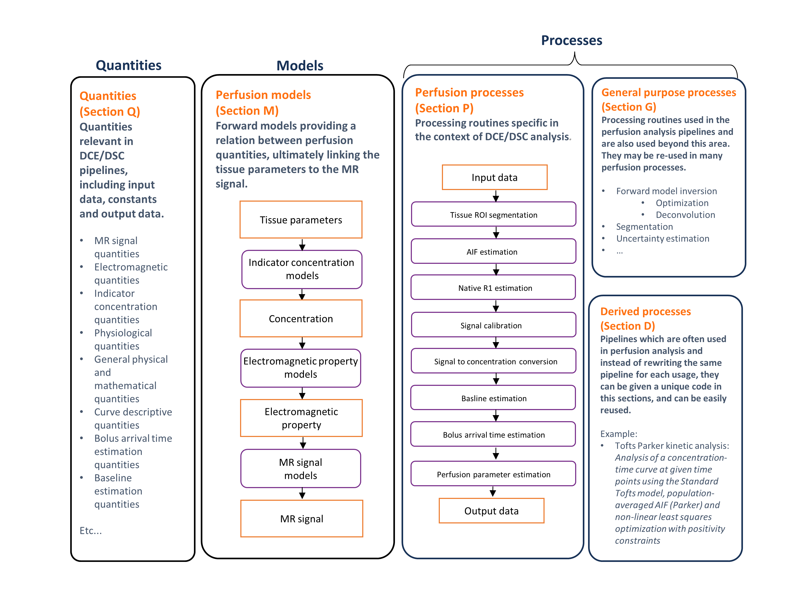

# CAPLEX structure

- CAPLEX is organized into 4 sections which group together similar quantities, models or processes. 

## Quantities (section Q)
- Items in this section represent variables that usually act as input or output to an analysis process, for example the longitudinal relaxation rate is a quantity. 

## Models (section M)
- Items in this section are mathematical formulae that relate quantities to one another, and are typically used to describe the functional behaviour of measured data.
- It is common fit these models to data using an optimiser, with parameters either free or fixed. Since the choice of parameters to fix or keep free during optimisation may vary, we specify only the model formula and quantities involved, leaving the user to specify which are free or fixed using the Model Parameters and Static Model Parameters quantities respectively.
- Since models often have multiple possible parameterisations (particularly true for kinetic models) and are sometimes nested, models are defined using a harmonised parameterisation such that models can be easily compared, and to improve consistency of reporting.

## Perfusion Processes and General Purpose Processes (Section P and section G)
- Items in this section are operators that generate output quantities from given input quantities.
- They define semantically what is done, in a similar way to a function or routine name within a programming environment, but provide only high-level detail of the implementation. For example, Variable Flip Angle is a process that maps variable flip angle signal intensities to the longitudinal relaxation rate and equilibrium magnetisation.
- All the required inputs to this process (quantities, models, and other processes) are defined by the lexicon entry. This approach minimises the risk the user will fail to report all the relevant information.

<figure markdown>
  { width="1300" }
  <figcaption> Organization of CAPLEX sections: Quantities (Section Q), Perfusion models (Section M), Perfusion processes (Section P), General purpose processes (Section G) and Derived processes (Section D). In the flow charts, quantities are given in orange boxes, processes and models are shown in purple boxes. The pipeline shown in the    perfusion processes box represents a typical pipeline that can be encoded using quantities, processes and models currently defined within CAPLEX version 1.0.3. It is possible to encode pipelines with fewer or entirely different processes than those shown (e.g. using R2 or R2* estimation and leakage correction when reporting DSC-MRI analyses).</figcaption>
</figure>
